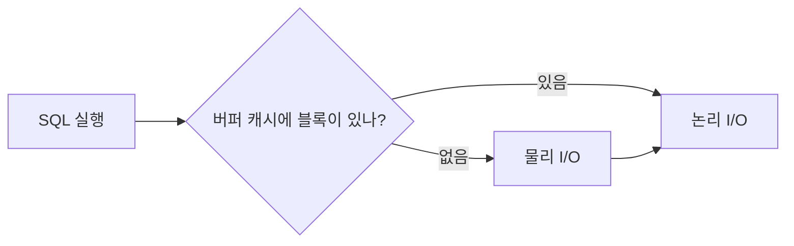

# weekNN 이론 노트 — <주제> (발표: <github-id>)

> 이 파일을 `weeks/weekNN-<topic>/theory/<github-id>.md` 로 복사해서 작성하고, **스터디 2~3일 전에 PR**을 올립니다.
> 스터디원은 PR 리뷰 코멘트로 질문을 남기고, 발표는 그 질문에 답하는 방식으로 진행합니다. 토론 결과를 반영한 뒤 머지합니다.
>
> 작성 원칙
> - 책을 옮기지 않습니다. 요약·재구성만 하고, 인용은 짧게 출처(책 권·장·쪽)를 붙입니다.
> - 책 그림을 스캔·촬영해 올리지 않습니다. 그림은 아래처럼 Mermaid로 직접 그립니다.
> - 모든 개념은 "이번 주 실습의 어느 단계에서 어떤 수치로 확인되는가"와 연결합니다.

## 1. 한 줄 요약
<!-- 이번 주 주제를 한 문장으로. 예: "인덱스 튜닝의 핵심은 테이블 랜덤 액세스를 줄이는 것이다" -->

## 2. 핵심 개념
| 개념 | 한 줄 정의 | 왜 중요한가 |
|---|---|---|
| | | |
| | | |
| | | |

## 3. 동작 원리
<!-- 처리 흐름, 구조, 비용이 발생하는 지점을 그림과 함께 설명 -->

## 4. 실습으로 확인하기
| 개념 | 실습 단계 | 확인할 수치 | 이번 주 실제 결과 |
|---|---|---|---|
| | `02_lab.sql` [n] | Buffers / Starts / E-Rows 등 | |

## 5. 시험 포인트
- **필기:** 자주 나오는 함정, 헷갈리는 비교
- **실기:** 튜닝 서술에서 이 개념을 쓰는 방법

## 6. 23ai에서 달라진 점
<!-- 이번 주 README의 "책과 다른 점"을 바탕으로, 원리 관점에서 왜 달라졌는지 -->

## 7. 함께 토론할 질문
1.
2.

## 8. 참고 자료
- 『오라클 성능 고도화 원리와 해법』 N권 N장
- Oracle Database 23ai 공식 문서: <!-- 링크 -->
